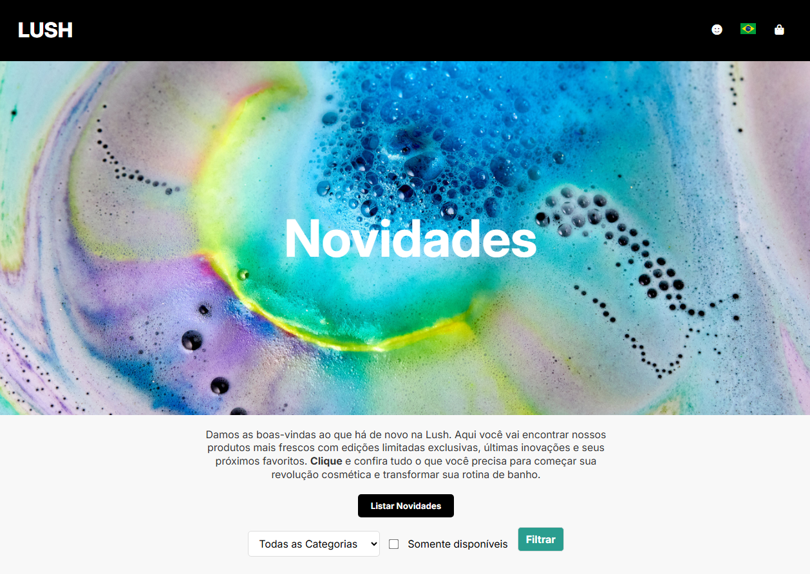

# CP3 - WEB Development FIAP

Estudo sobre manipulação de DOM, Arrays e Objetos; utilizando como referência a identidade visual da Lush.

## Screenshot

## Funcionalidades

- Lista de produtos
- Formulário com select de categorias e opção de checkbox de categorias disponíveis
- Filtro com base nas seleções de categorias e disponibilidade
- Destaque nos produtos com o mouse hover

## Sobre mim
Sou graduanda em Engenharia de Software na FIAP, desbravando o mundo dev e ainda na batalha de alinhar uma div! ʕ•ᴥ•ʔ

## Referência

 - [LUSH | New Products](https://www.lush.com/uk/pt/c/new-products)